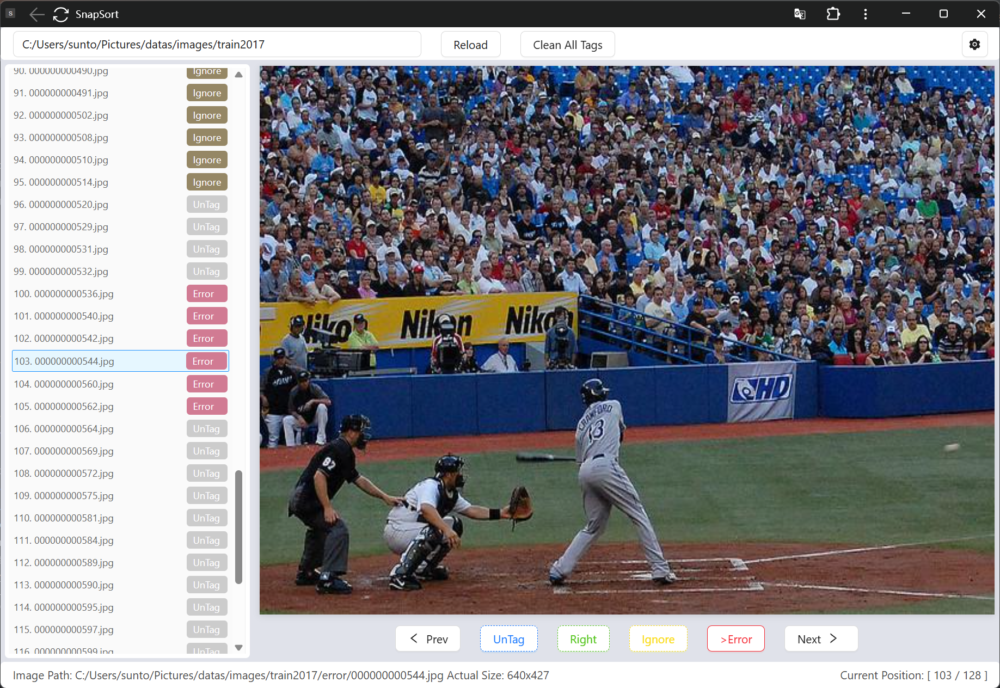

# SnapSort

> Quickly sort images in a folder by dragging and dropping them into the correct order.

## Usage

```
git clone https://github.com/xx025/SnapSort.git
pip install uv # IF YOU HAVE UV , SKIP THIS STEP
uv sync
uv run app.py
```


